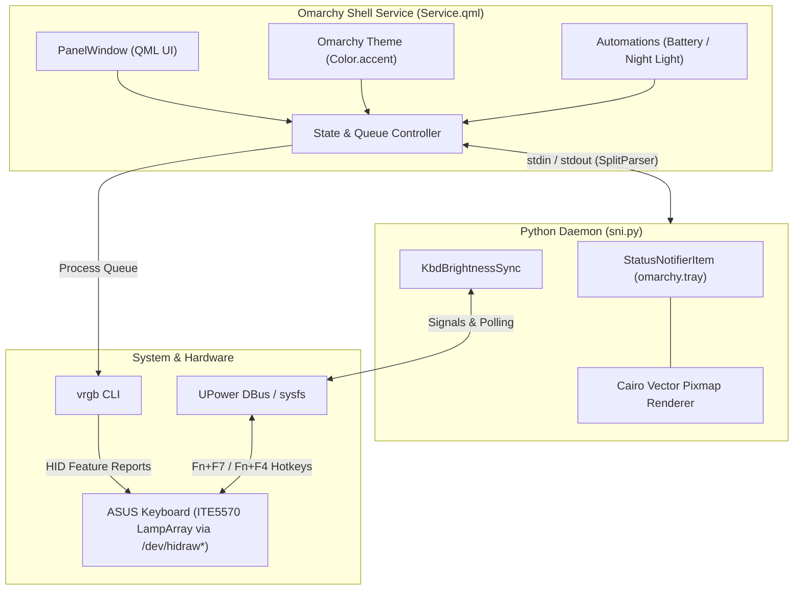

# How It Works: Architecture & Deep Dive

This document explains the internal architecture, hardware protocols, and desktop integration of **omarchy-kbd-rgb**.

---

## 1. System Architecture

---

## 2. Hardware Interface: HID LampArray vs. WMI

Standard ASUS gaming laptops (ROG, TUF) expose keyboard lighting controls through the **ASUS ACPI/WMI** interface managed by `asus-wmi` or `asusctl`. 

In contrast, ASUS Vivobook laptops (such as the S14 `S5406SA` and S16 `M5606K`) use the **Microsoft HID LampArray standard** (introduced for Windows Dynamic Lighting) operated by an **ITE5570** micro-controller.

- The keyboard lighting cannot be adjusted via standard WMI color registers.
- Communication occurs directly via HID feature reports over `/dev/hidraw*`.
- The plugin delegates low-level HID communication to **`vrgb`**, which sends raw feature reports to the controller.

---

## 3. Bidirectional Hardware Brightness Synchronization

ASUS Vivobook hotkeys (<kbd>Fn</kbd>+<kbd>F7</kbd> and <kbd>Fn</kbd>+<kbd>F4</kbd>) generate ACPI brightness events handled by `asus-nb-wmi` and exposed through `UPower` and `/sys/class/leds/asus::kbd_backlight/`.

`sni.py` maintains bidirectional synchronization:
1. **Hardware $\rightarrow$ UI**: Listens for DBus signals on `org.freedesktop.UPower.KbdBacklight.BrightnessChanged`. When a hotkey is pressed, `sni.py` emits `hw_brightness <percent>` to `Service.qml`, updating the UI slider and synchronizing the LampArray intensity.
2. **UI $\rightarrow$ Hardware**: When the brightness slider in the panel is moved, `Service.qml` sends `set_hw_brightness <percent>` to `sni.py`, which updates UPower / sysfs to keep the system brightness state consistent.
3. **Echo Prevention**: A `pending_val` state filter ensures signals originating from the UI are not echoed back, preventing feedback loops.

---

## 4. Vector Keyboard Tray Icon (StatusNotifierItem)

Rather than rendering static system icons or basic color squares, `sni.py` implements a custom **StatusNotifierItem (SNI)** with dynamic vector graphics:
- **Cairo Rasterization**: Renders a 22×22 anti-aliased keyboard outline with individual keycaps and a spacebar.
- **ARGB32 Big-Endian Pixmap**: Converts Cairo BGRA byte buffers into network-byte-order ARGB32 pixmaps (`a(iiay)`) expected by Qt and Quickshell tray hosts.
- **Dynamic Tinting**:
  - **Static / Theme Mode**: Illuminated in the active color.
  - **Rainbow Mode**: Renders a multi-stop horizontal linear rainbow gradient.
  - **Off Mode**: Renders in a subtle, translucent muted gray.
- **Memoization**: Rendered pixmaps are cached by `(hex, mode)` to eliminate memory allocations during continuous use.

---

## 5. Smart Automations

- **Battery Saver**: Subscribes to `Quickshell.Services.UPower`. If the system is running on battery power and the charge drops to $\le 25\%$, the keyboard backlight automatically caps to 33% (or off) and restores previous brightness when AC power is reconnected.
- **Night Light Warm Tint**: Monitors Omarchy's `omarchy.nightlight` / `hyprsunset` service. When active, shifts the keyboard backlight to zero-blue warm amber (`#FF7700`) and restores the user's custom color once Night Light is dismissed.

---

## 6. Process Queue & IPC Architecture

- **Sequential Command Queue**: `Service.qml` queues all `vrgb` process executions sequentially (`enqueue()` $\rightarrow$ `pump()`), preventing concurrent access conflicts on `/dev/hidraw`.
- **Queue Compaction**: Rapid slider or color inputs drop obsolete intermediate requests, ensuring only the latest intended state executes.
- **Boot Persistence**: Every color change persists to the `kbd` profile and automatically restores upon shell startup or system boot.
